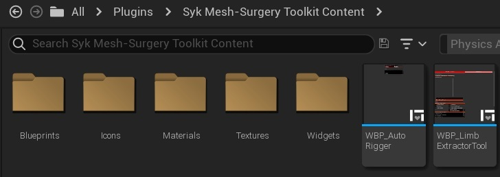
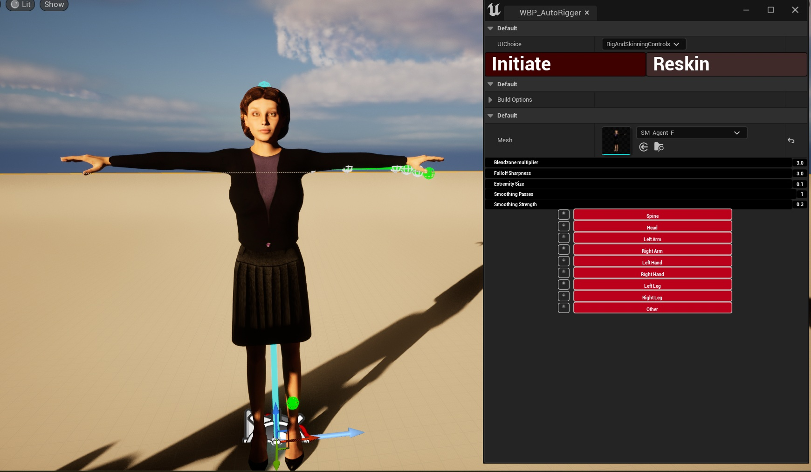
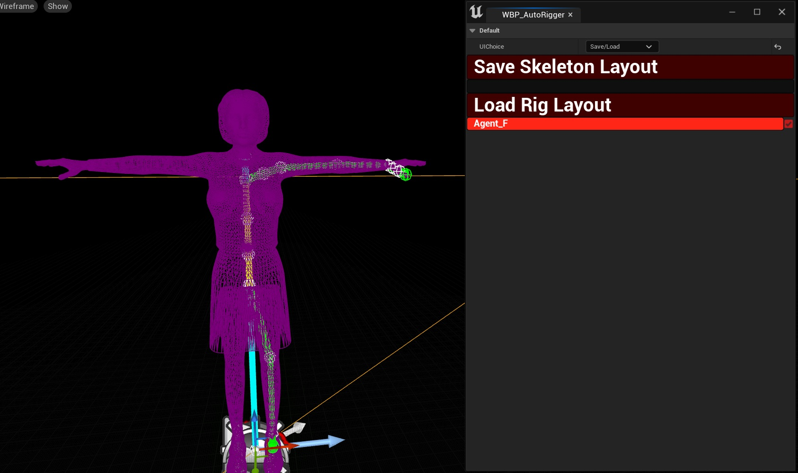
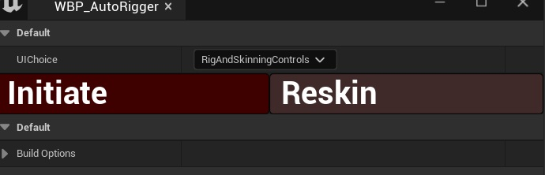
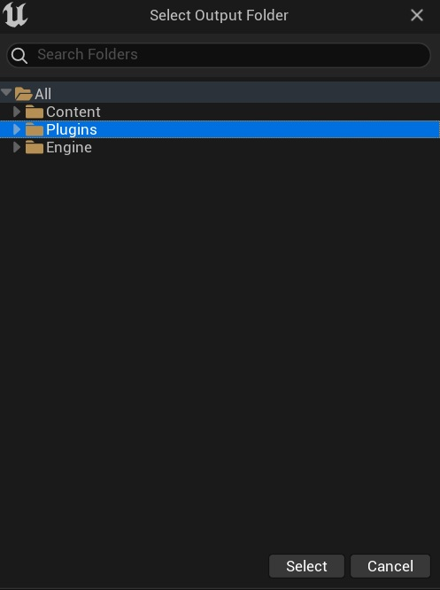
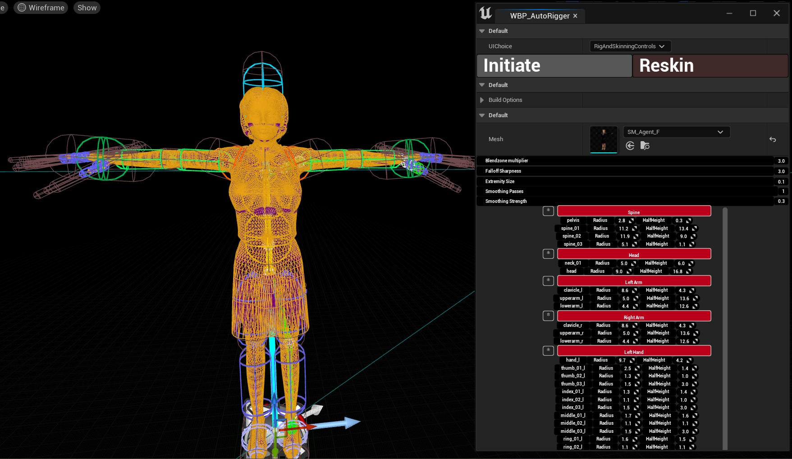
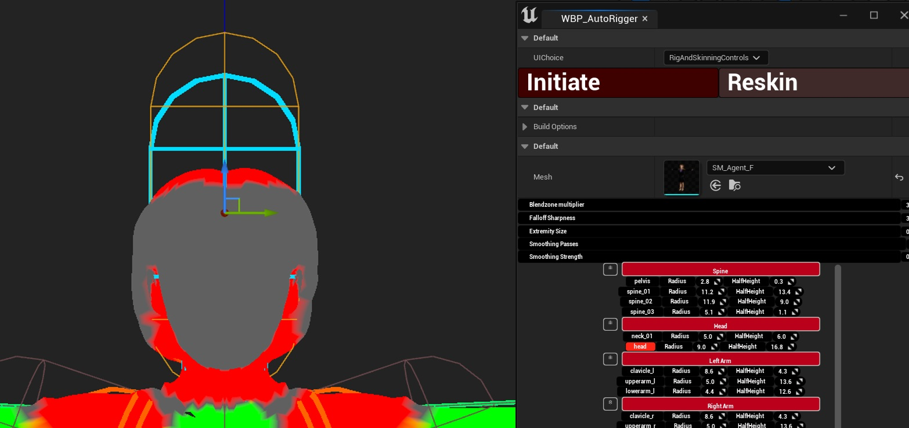
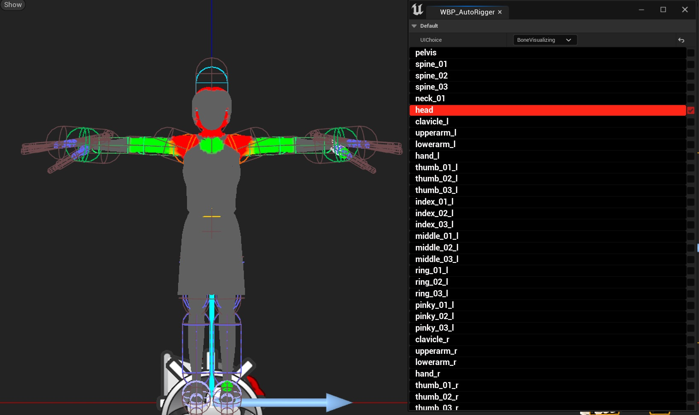
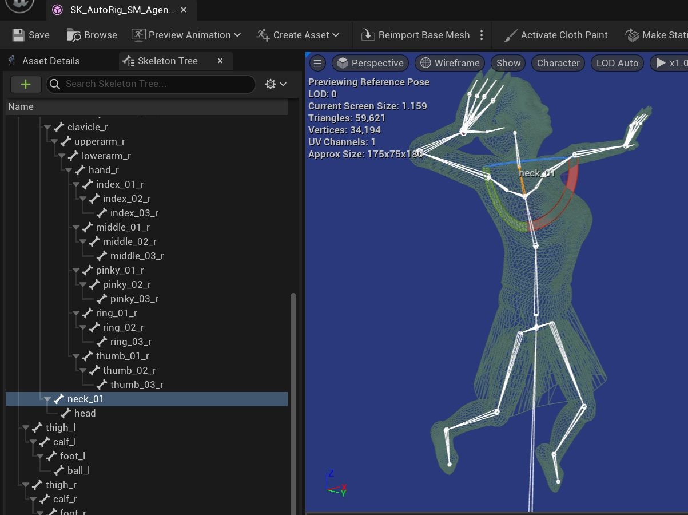

# Quick Start: Auto Rigging & Skinning

This guide walks you through the complete process of rigging and skinning a humanoid static mesh using UAutoRigger — from opening the tool to saving your finished skeletal mesh. No prior rigging experience required.

---

## What You Will Need

- A humanoid static mesh imported into your Unreal Engine project
- UAutoRigger plugin enabled (see [Installation](Installation.md))

---

## Step 1 — Open the AutoRigger Editor Utility

In the Content Browser, locate the **UAutoRigger** editor utility and right-click and select **Run Editor Utility** to open it. This launches the rigging panel inside the Unreal editor.

---

## Step 2 — Select Your Static Mesh

In the rigging panel, use the mesh picker to select the static mesh you want to rig. Once selected, UAutoRigger will automatically spawn an instance of that mesh in the current level, attached to a **Markup Actor**.

> The Markup Actor is your workspace for the rigging session. All marker placement and rig preview happens through this actor.

---

## Step 3 — Place Your Markers

Markers are draggable objects placed in the viewport that define where key anatomical landmarks are on your mesh. Lines connecting the markers are drawn in the viewport to give you a live preview of the skeleton being defined.

**To place markers:**

1. In the viewport, locate the marker handles that have spawned around the mesh
2. Click and drag each marker to the correct position on the mesh — for example, drag the head marker to the top of the skull, the hip marker to the pelvis centre, and so on
3. Use the connecting debug lines as a guide — they should roughly follow the spine, limbs, and joints of your character

**Key markers to position carefully:**

| Marker | Placement guidance |
|---|---|
| Root / Hips | Centre of the pelvis |
| Spine markers | Along the centreline of the back |
| Shoulders | At the shoulder joint, not the edge of the mesh |
| Elbows / Knees | At the actual joint pivot point |
| Wrists / Ankles | At the actual joint pivot point |
| Head | Base of the skull |
| Finger tips & knuckles | At each joint along each finger |

> **Tip:** Take your time with marker placement — the quality of your rig and skin weights depends directly on how accurately the markers match your mesh's anatomy.  Use Front, Right etc views to assist

---

## Step 4 — Initialize the Rig

Once you are happy with your marker positions, click the **Initiate** button in the rigging panel.

A Save Folder selection dialog will pop-up - choose an output folder for the mesh.

UAutoRigger will process your marker positions and compute the rig. When complete, a set of **Capsule Rig Handles** will spawn in the viewport around your mesh. These capsules represent the influence volumes that drive skin weight calculation for each bone.

---

## Step 5 — Adjust the Capsule Handles

The capsule handles are fully interactive. You can move, rotate, and resize them in the viewport to better fit the mesh geometry.

Getting the capsules to closely wrap the mesh surface will produce cleaner skin weights, particularly around the shoulders, hips, and neck where geometry is more complex.

> **Tip:** Capsules do not need to be a perfect fit — a reasonable approximation is enough for good results. You will be able to refine weights manually in the next step.

---

## Step 6 — Preview Bone Influences

Before committing to the skin weights, you can inspect how each bone influences the mesh:

1. In the rigging panel, select one or more bones from the bone list
2. The mesh material in the viewport will update to show a **heat map** of that bone's influence — red indicates strong influence, blue indicates weak or no influence
3. If the influence looks wrong for a bone, go back and adjust its capsule handle and check again

This heat map view gives you immediate visual feedback without needing to leave Unreal or open an external DCC tool.

---

## Step 7 — Re-Skin and Iterate

If you adjust any capsule handles after reviewing the heat map, click **Re-Skin** in the rigging panel. UAutoRigger will recompute the skin weights based on the updated capsule positions and refresh the heat map display.

Repeat the adjust → re-skin → review cycle until you are happy with the weight distribution across the mesh.

---

## Step 8 — Save the Skinned Mesh

Once you are satisfied with the skin weights:

Your skeletal mesh is now ready to use — it can be animated, used with Unreal's weight painting tools for further refinement, or exported for use in other tools.

---

## Next Steps

- [Auto Skinning — How It Works](AutoSkinning.md)
- [Marker System Reference](MarkerSystem.md)
- [Adjusting Skin Weights in UE5's Weight Painter](BoneWeightExtraction.md)
- [Rigging Controls Reference](RigAndSkinControls.md)
