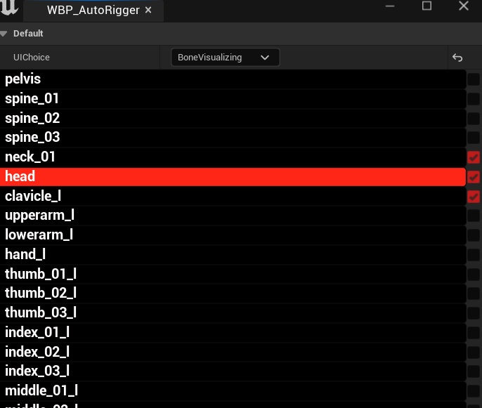
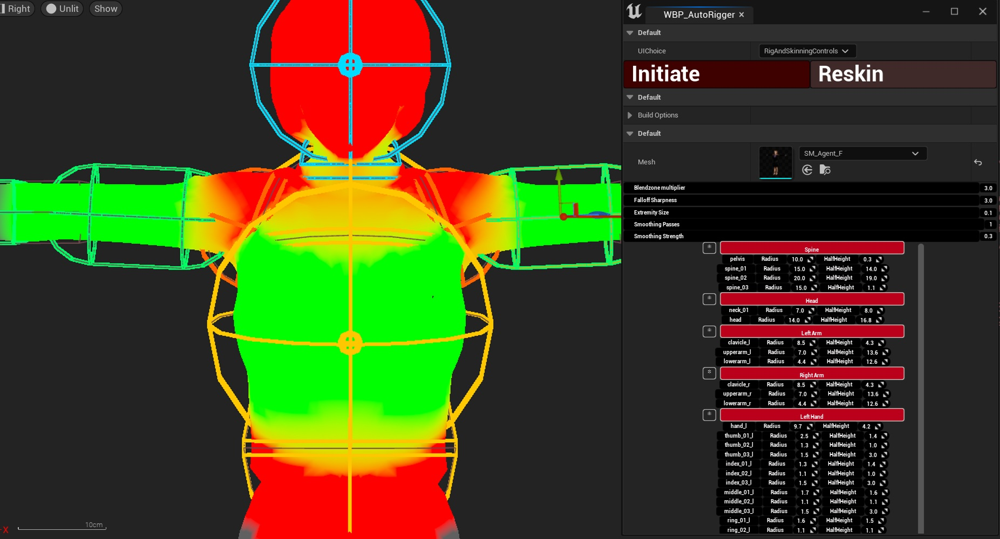

# Bone Visualizer UI
---

This UI allows the user to select which bones heatmap/influence will show, and/or merge with neighbouring bones
on the Preview Mesh

Selecting a bone will show the heatmap color on the Preview Mesh, and deselecting it will hide it

The heatmap helps to make sure the Influence zone is covering/blending with the desired areas, and to make sure 
there is full mesh coverage
