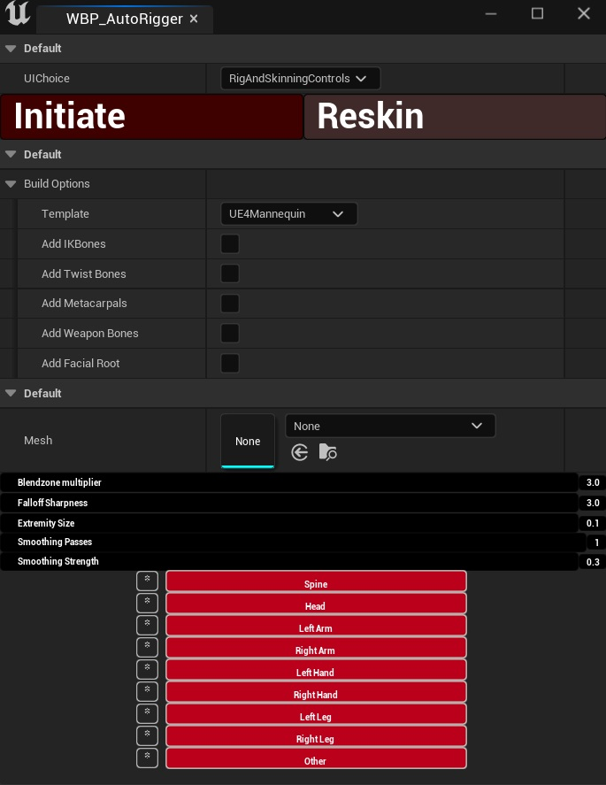

# Rigging And Skinning UI Details

## Initiate

- Takes the input mesh and calculates approprate capsule radii for the skinning.  
- Generates CapsuleRigHandles based on those radii
- Provides the user a base Rigged and skinned mesh according to the build options and skinning settings

## ReSkin

- Takes the users changes to the CapsuleRigHandles and skinning settings, and ReSkins the current mesh

## Build Options

- Template changes between UE4 default skeleton and UE5 default skeleton
- Add Bones : True to add Stated bones - False to leave them out

## Mesh

- Choose a Static Mesh to use as an Input

## Skinning Quality Controls

These settings are available in the AutoRigger panel and control how skin weights are calculated and smoothed across the mesh. Adjusting these before hitting **Re-Skin** allows you to fine-tune deformation quality without manually painting weights.

| Setting | Default | Description |
|---|---|---|
| **Blendzone Multiplier** | 3.0 | Controls how far each bone's influence extends beyond its capsule boundary. Higher values create softer transitions between bones but can cause influence bleed into neighbouring areas. |
| **Falloff Sharpness** | 3.0 | Controls how quickly a bone's influence drops off toward the edge of its capsule. Higher values produce harder, more defined boundaries. Lower values produce softer, more gradual blending. |
| **Extremity Size** | 0.1 | Controls capsule radius scaling for small extremity bones such as fingers and toes. Lower values keep influence tightly contained, preventing small bones from affecting neighbouring geometry. |
| **Smoothing Passes** | 1 | The number of times the smoothing algorithm runs across the mesh after initial weight calculation. More passes produce smoother transitions but can soften boundaries you may want to keep sharp. |
| **Smoothing Strength** | 0.3 | How strongly each smoothing pass blends a vertex's weights with its neighbours. Higher values produce more aggressive smoothing per pass. Works in combination with Smoothing Passes. |

---

## Recommended Starting Points

For a standard humanoid character, the defaults are a reasonable starting point. Common adjustments:

- **Shoulders and hips deforming poorly** — reduce Blendzone Multiplier slightly and increase Falloff Sharpness
- **Finger weights bleeding into the hand** — reduce Extremity Size
- **Harsh weight boundaries visible on smooth surfaces** — increase Smoothing Passes or Smoothing Strength
- **Influence boundaries too soft and losing definition** — reduce Smoothing Passes to 0 and rely on Falloff Sharpness instead

## Bone Override Widgets

- These populate with each bone associated with the particular group
- Each bone in the group has adjustable Radii and HalfHeight values that will directly modify the corresponding CapsuleRigHandle
