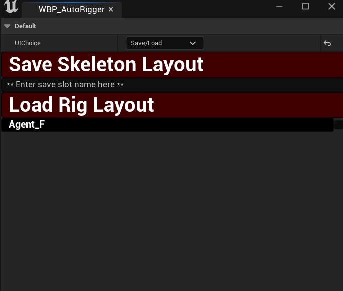

# Save/Load UI
---

This UI allows the user to save and load Markup positions from the MarkupActor.
Once markups are moved into the desired position, a save name may be entered into the field. 
Once enter is pressed, it will save to the config folder in the project folder.

Loading a save is as simple as choosing from the save list entries that are populated upon a mesh being selected.
Save files are not specific to any mesh, they are a record of world positions for each markup.  
Once a save file has been selected, upon being clicked, the markups will automatically be positioned to the locations saved in the file
